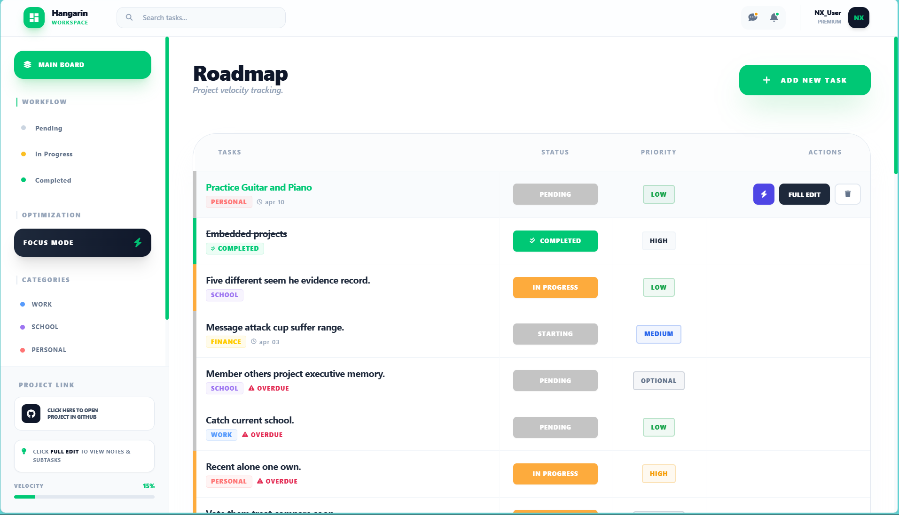

# 🚀 Hangarin Workspace
**Modern Task Orchestration | High-Velocity Productivity**

Hangarin is a high-performance dashboard designed for teams who value aesthetic clarity and real-time efficiency. Built with a **Glassmorphism UI**, it provides a seamless experience for tracking roadmaps and managing complex workflows.

---

## ✨ Key Features

* **⚡ Real-Time Interaction:** Powered by **HTMX** for instant updates without page refreshes.
* **🎨 Dynamic Design:** Priority colors and Category tags are managed directly from the Django Admin.
* **🔍 Focus Mode:** A distraction-free toggle to highlight your most critical tasks.
* **📊 Velocity Tracking:** Automated progress bars that calculate your project completion percentage.
* **📁 Task Intelligence:** Integrated sidebar for subtasks, notes, and quick-edit functionality.
* **🌓 Modern UI/UX:** Built with Tailwind CSS for a glassmorphism-inspired aesthetic.

## Tech Stack
**Backend:** Python 3.10+, Django 5.1+

**Frontend:** Tailwind CSS, Alpine.js, HTMX

**Database:** SQLite (Development) / PostgreSQL (Production)

**Deployment:** PythonAnywhere / GitHub Actions

---

## 🔐 Administrative Access

Manage your priorities, users, and categories through the secure portal. Use these credentials for the initial setup:

| Field | Detail |
| :--- | :--- |
| **Admin URL** | `http://127.0.0.1:8000/admin` |
| **Username** | `Nexie` |
| **Password** | `nexyness23` |

> **Pro Tip:** Use the **Priority** section in the Admin to change HEX colors. The dashboard automatically applies a **15% opacity tint** to your chosen color for a professional UI look.

---
## Deployed Url (pythonanywhere)
| **URL** | `https://nexy.pythonanywhere.com` |

## Project Interface: Main Task Dashboard


## 🚀 Launch & Installation

Follow these steps to get your local development environment running:

### 1. Setup Environment
```bash
# Clone the repository
git clone https://github.com/NexieMadia23/Hangarin
cd Hangarin

# Create and activate virtual environment
python -m venv venv
# Windows: venv\Scripts\activate | Mac: source venv/bin/activate

# Install dependencies
pip install -r requirements.txt


# Apply migrations to set up the database
python manage.py migrate

# Start the development server
python manage.py runserver
